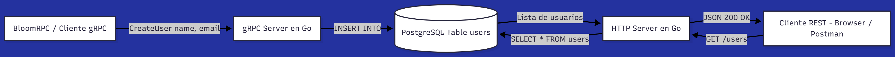

# gRPC + REST + Go + PostgreSQL (BloomRPC Demo)

Proyecto de ejemplo escrito en **Go** que muestra cómo:

- Exponer un **servicio gRPC** para crear usuarios (ideal para probar con **BloomRPC**).
- Guardar los datos en una base **PostgreSQL**.
- Exponer un endpoint **REST `GET /users`** para listar todos los usuarios.
- Separar la configuración de la base de datos en un módulo externo (`config`) y la conexión en otro (`db`).

Es un proyecto perfecto para:
- Practicar **gRPC en Go**.
- Entender cómo combinar **gRPC + REST** en el mismo binario.
- Usar **PostgreSQL** como capa de persistencia.

---

## 🧱 Arquitectura general

### Flujo de funcionamiento

- **gRPC**:
  - Método `CreateUser(name, email)`.
  - Inserta el usuario en la tabla `users` de PostgreSQL.
- **REST**:
  - Endpoint `GET /users`.
  - Consulta todos los usuarios desde PostgreSQL.
  - Devuelve la lista en formato JSON.
 
 ##🔧 Configuración de la base de datos

CREATE DATABASE bloomgrpc;

\c bloomgrpc;

CREATE TABLE users (
  id SERIAL PRIMARY KEY,
  name  VARCHAR(100) NOT NULL,
  email VARCHAR(200) NOT NULL UNIQUE
);

#### 🚀 Ejecución
protoc --go_out=. --go-grpc_out=. proto/user.proto

##### 🚀 Levantar servidores
go run ./cmd/server

